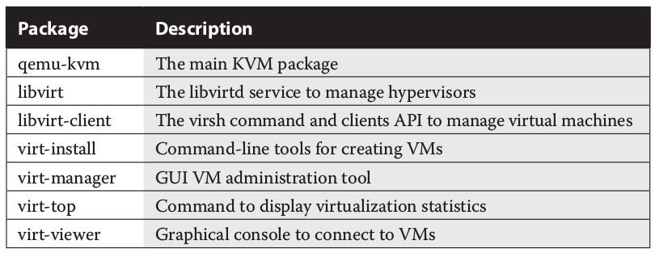

=====
kvm
=====

Does my CPU support Virtualization and is it enabled in BIOS / UEFI?
---------------------------------------------------------------------

::

   [gans@server1 ~]$ grep -c vmx /proc/cpuinfo
   1
   [gans@server1 ~]$
   [gans@server1 ~]$ lsmod | grep kvm
   kvm_intel             170086  0 
   kvm                   566340  1 kvm_intel
   irqbypass              13503  1 kvm

How to run nested KVM within VMWare ESXi (5.5)
-----------------------------------------------

1. Shutdown the VM

2. Locate the guest hypervisor virtual machine configuration file (<VM-name.vmx>), edit and add the following line at the end
::

   vhv.enable = "TRUE"

3. Identify the nested hypervisor vm ID and reload it's configuration with the **vim-cmd esxi command**
::

   ~ # vim-cmd vmsvc/getallvms | grep -i 50_s1
       30     RH_Lab122_50_s1          [datastore3] RH_Lab122_50_s1/RH_Lab122_50_s1.vmx             rhel6_64Guest           vmx-10              
   ~ # 
   ~ # vim-cmd vmsvc/reload 30

4. Start the VM

5. Verify that the nested hypervisor correctly detects the vmx flag
::

   [gans@server1 ~]$ grep -c vmx /proc/cpuinfo
   1

Packages to install for KVM in RHEL
------------------------------------

These can be installed via the GNOME Software Manager

As an alternative, install the Virtualization Host and Virtualization Client groups::

   # yum group install "Virtualization Host" "Virtualization Client"

