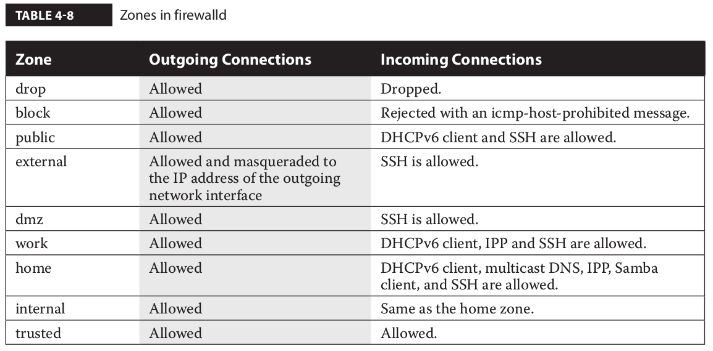

############
firewall
############

Firewall status

::

   systemctl status firewalld

::

   iptables -L

The iptables tool is the basic foundation that is used by other services to manage system
firewall rules. RHEL 7 comes with two such services: the new firewalld daemon and the
iptables service, which was included with the previous releases of Red Hat Enterprise Linux.
You can interact with firewalld using the graphical utility **firewall-config** or the command-
line client **firewall-cmd**.

The iptables and firewalld services both rely on the Netfilter system within the Linux kernel
to filter packets. However, whereas **iptables** is based on the concept of “chain of filter rules” to
block or forward traffic, firewalld is “zone-based,” as you will see in the next sections.

::

   iptables -t tabletype <action_direction> <packet_pattern> -j <what_to_do>

**tabletype**

   * filter  Sets a rule for filtering packets.
   * nat  Configures network address translation, also known as masquerading

**action_direction**

   * -A (--append)  Appends a rule to the end of a chain.
   * -D (--delete)  Deletes a rule from a chain. Specify the rule by the number or the packet pattern.
   * -L (--list)  Lists the currently configured rules in the chain.
   * -F (--flush)  Flushes all the rules in the current iptables chain.

If you’re appending to (-A) or deleting from (-D) a chain, you’ll want to apply it to
network data traveling in one of three directions:

   * INPUT  All incoming packets are checked against the rules in this chain.
   * OUTPUT  All outgoing packets are checked against the rules in this chain.
   * FORWARD  All packets received from a computer and being sent to another computer are checked against the rules in this chain. 
     In other words, these are packets that are routed through the local server.

**packet_pattern**

   * \-s ip_address  All packets are checked for a specific source IP address.
   * \-d ip_address  All packets are checked for a specific destination IP address.

Packet patterns can be more complex. In TCP/IP, packets are transported using the
TCP, UDP, or ICMP protocol. You can specify the protocol with the -p switch, followed by
the destination port (--dport). For example, the -p tcp --dport 80 extension affects users
outside your network who are trying to make an HTTP connection.

**what_to_do**

   * DROP  The packet is dropped. No message is sent to the requesting computer.
   * REJECT  The packet is dropped. An error message is sent to the requesting computer.
   * ACCEPT  The packet is allowed to proceed as specified with the -A action: INPUT, OUTPUT, or FORWARD.

The firewalld Service
------------------------

The firewalld service offers the same functionalities of the iptables tool and more. One
of the new features of firewalld is zone-based firewalling. In a zone-based firewall, networks
and interfaces are grouped into zones, with each zone configured with a different level of
trust. The zones defined in firewalld are listed in Table 4-8, along with their default behavior
for outgoing and incoming connections.

A zone is made up of a group of source network addresses and interfaces, plus
the rules to process the packets that match those source addresses and network
interfaces.

The Zone tab includes all the zones previously listed. 
When an incoming packet hits the firewall, its source address is checked for a match with the network addresses
that belong to the existing zones. If no match is found, the incoming interface of the packet
is checked to verify whether it belongs to a zone. Once a correspondence is found, the
packet is processed according to the rules of the zone it has been matched to.

If you switch the **firewall-config** tool into Permanent mode, you can add new services
or edit existing ones. To accomplish this task, scroll to the bottom of the Services window
and click the corresponding icon to remove, add, or edit a service. If desired, you can also
configure custom ports for an existing service by clicking the Add or Edit icon

**The Console firewall-cmd Configuration Tool**

The firewall-cmd configuration tool has the same features and services as the corresponding
GUI tool. In fact, both the graphical firewall-config tool and the command interface
firewall-cmd are just client front ends that communicate to the underlying firewalld daemon.

As with the GUI tool, **firewall-cmd** can display all the available zones and switch to a
different default zone. In the following example, the default zone is changed from the public
to the internal zone:

::

   # firewall-cmd --get-default-zone
   public
   # firewall-cmd --set-default-zone=internal
   success
   # firewall-cmd --get-default-zone
   internal
   #

The option **--list-all** is particularly useful. It lists all the configured interfaces and
services allowed through a zone, as illustrated next:

::

   public (active)
     target: default
     icmp-block-inversion: no
     interfaces: ens192
     sources: 
     services: ssh dhcpv6-client http ftp vnc-server
     ports: 
     protocols: 
     masquerade: no
     forward-ports: 
     source-ports: 
     icmp-blocks: 
     rich rules: 

As with many of the firewall-cmd command options, the default zone is assumed if no zone is specified with the --zone command switch.
You can add and remove ports and services from a zone with the **--add-port, --add-service, --remove-port, and --remove-service**
switches, respectively. 
The next example enables the http service for traffic hitting the dmz zone:

::

   # firewall-cmd --zone=dmz --add-service=http
   success
   #

By default, all configuration changes made by **firewall-cmd** do not survive a server
reboot. To make a change that survives a reboot, add the **--permanent** switch to firewall-cmd. 
Then, run firewall-cmd --reload to implement the change immediately.

Return to the original system. Run the following commands to install and start the telnet service:

::

   yum install telnet-server
   systemctl start telnet.socket

**Example Firewall configuration**

Run the following command to show the current settings for the default zone:

::

   firewall-cmd --list-all

Allow telnet traffic through the default zone. Don’t forget the --permanent switch to make the change persistent:

::

   firewall-cmd --permanent --add-service=telnet

Apply the previous change to the run-time configuration of the firewall:

::

   firewall-cmd --reload