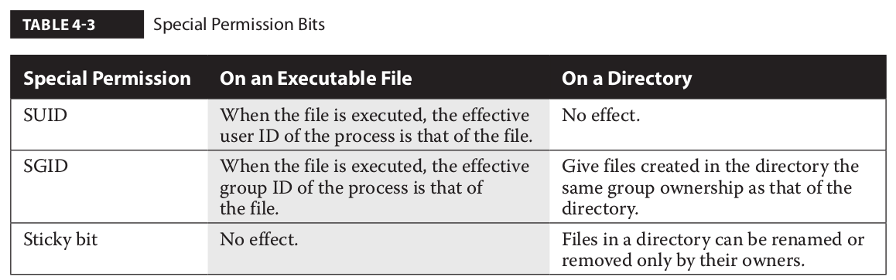
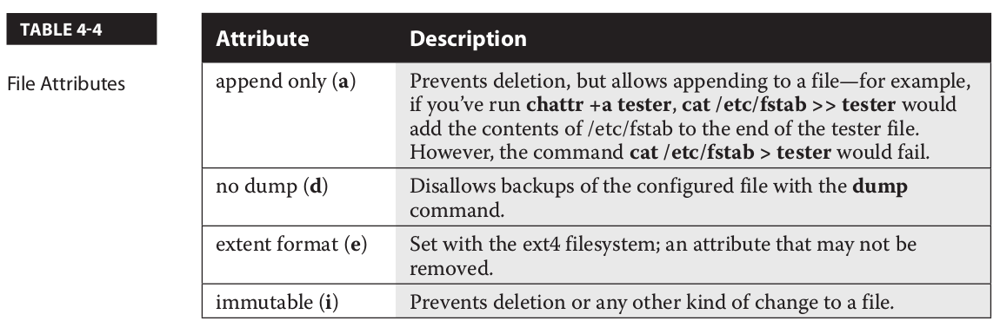

#################
permissions
#################

chmod
------

The chmod command uses the numeric value of permissions associated with the owner,
group, and others. In Linux, permissions are assigned the following numeric values: r = 4,
w = 2, and x = 1. In numerical format, permissions are represented by an octal number,
where each digit is associated with a different group of permissions. For example, the
permission number 640 means that the owner is assigned permission 6 (read and write),
whereas the group has permission 4 (read), and everyone else has no permissions.

Special Permission Bits
------------------------

For the SUID, SGID, and sticky bits, some special options are available. If you choose to
use numeric bits, those special bits are assigned numeric values as well, where SUID = 4,
SGID = 2, and sticky bit = 1. For example, the following command configures the SUID bit
(with the first “4” digit in permission mode). It includes rwx permissions for the user owner
(with the “7”), rw permissions for the group owner (with the “6”), and r permission for other
users (with the last “4”) on the file named testfile:

::

   chmod 4764 testfile

If you’d rather use the ugo/rwx format, the following command activates the SGID bit for
the local testscript file:

::

   chmod g+s testscript

And the following command turns on the sticky bit for the /test directory:

::

   chmod o+t /test

File Attributes
----------------

The following command protects /etc/fstab from accidental deletion, even by the root
administrative user:

::

   chattr +i /etc/fstab

With that attribute, if you try to delete the file as the root administrative user, you’ll get
the following response:

::

   rm /etc/fstab
   rm: remove regular file '/etc/fstab'? y
   rm: cannot remove '/etc/fstab': Operation not permitted

The lsattr command shows an active immutable attribute on /etc/fstab:

::

   lsattr /etc/fstab
   ----i----------- /etc/fstab

Several key attributes are described in Table 4-4. Other attributes, such as c (compressed),
s (secure deletion), and u (undeletable), don’t work for files stored in the ext4 and XFS
filesystems. The extent format attribute is associated with ext4 systems.

UMASK
-------

Explain Octal umask Mode 022 And 002

If the default settings are not changed, files are created with the access mode 666 and directories with 777. 
In this example:

   * The default umask 002 used for normal user. With this mask default directory permissions are 775 and default file permissions are 664.
   * The default umask for the root user is 022 result into default directory permissions are 755 and default file permissions are 644.
   * For directories, the base permissions are (rwxrwxrwx) 0777 and for files they are 0666 (rw-rw-rw).

In short:

   * A umask of 022 allows only you to write data, but anyone can read data.
   * A umask of 077 is good for a completely private system. No other user can read or write your data if umask is set to 077.
   * A umask of 002 is good when you share data with other users in the same group. Members of your group can create and modify data files; those outside your group can read data file, but cannot modify it. Set your umask to 007 to completely exclude users who are not group members.

**Calculating The Final Permission For FILES**

You can simply subtract the umask from the base permissions to determine the final permission for file as follows:
   * 666 – 022 = 644

   * File base permissions : 666
   * umask value : 022
   * subtract to get permissions of new file (666-022) : 644 (rw-r–r–)

**Default UMASK**

With that in mind, the default umask is driven by the /etc/profile and /etc/bashrc files,
specifically the following stanza, which drives a value for umask depending on the value of
the UID:

::

    if [ $UID -gt 199 ] && [ "`id -gn`" = "`id -un`" ]; then
       umask 002
    else
       umask 022
    fi

Access Control Lists
--------------------

ACLs are supported on ext4 and XFS filesystems, as well as on the Network File System
(NFS) version 4.

**The getfacl Command**

::

   [root@server1 ~]# getfacl anaconda-ks.cfg
   # file: anaconda-ks.cfg
   # owner: root
   # group: root
   user::rw-
   group::---
   other::---

**Make a Filesystem ACL Friendly**

RHEL 7 uses the XFS filesystem. When you create an XFS or an ext2/ext3/ext4 filesystem
on RHEL 7, ACLs are enabled by default. On the other hand, ext2, ext3, and ext4 filesystems
created on older versions of Red Hat may not automatically have ACL support enabled.

To verify whether an ext2/ext3/ext4 filesystem has the acl mount option enabled
by default on a partition device such as /dev/sda1, run the command **tune2fs -l/dev/sda1**.

If you want to enable ACL support on a filesystem that does not have the acl mount
option configured, you can remount the existing partition appropriately. 
For example, we can remount the /home partition with ACL using the following command:

::

   mount -o remount -o acl /home

To make sure this is the way /home is mounted on the next reboot, edit /etc/fstab. 
Based on the previous command, the associated line might read as follows if /home is formatted with ext4:

::

   /dev/sda3   /home   ext4   defaults,acl   1,2

Once the change is made to /etc/fstab, you can activate it with the following command:

::

   mount -o remount /home

To confirm that the /home directory is mounted with the acl option, run the mount command alone, without switches or options. 
You should see acl in the output, similar to what’s shown here:

::

   /dev/sda3 on /home type ext4 (rw,acl)

Now you can start working with ACL commands to set access control lists on desired
files and directories.

Manage ACLs on a File
---------------------

::

   getfacl acltest/testfile 
   # file: acltest/testfile
   # owner: root
   # group: root
   user::rw-
   group::r--
   other::r--

Set ACL for a user

::

   setfacl -m u:michael:rwx acltest/testfile

::

   getfacl acltest/testfile 
   # file: acltest/testfile
   # owner: root
   # group: root
   user::rw-
   user:michael:rwx
   group::r--
   mask::rwx
   other::r--

Set ACL for a group

::

   setfacl -m g:users:r acltest/testfile

Remove ACLs for a user

::

   setfacl -x u:michael acltest/testfile

Remove all permissions for a user

::

   setfacl -m u:michael:- acltest/testfile

Remove all ACLs from a file

::

   setfacl -b acltest/testfile

::

   getfacl acltest/testfile 
   # file: acltest/testfile
   # owner: root
   # group: root
   user::rw-
   group::r--
   other::r--

One slightly dangerous option relates to other users.
For example, the command:

::

   setfacl -m o:rwx acltest/testfile

Sometimes, you may want to apply such ACLs to all files in a directory.
In that case, the **-R** switch can be used to apply changes recursively:

::

   setfacl -R -m u:michael:rx /home/gans/acltest

Default ACLs
-------------

Directories can also contain one or more default ACLs. The concept of a default ACL is
similar to a regular ACL entry, with the difference that a default ACL does not have any
effect on the current directory permissions, but it is inherited by the files created within
the directory.

As an example, if you want all new files and directories in /home/examprep to inherit
an ACL that grants read and execute permissions to the user michael, you can run the
following command:

::

   setfacl -d -m u:michael:rx /home/gans/acltest

The -d option in the preceding command specifies that the current operation applies to
a default ACL.

ACL and Masks
--------------

The mask associated with an ACL limits the permissions available on a file for named
users and groups, and for the group owner. The mask shown in Figure 4-2 is rwx, which
means there are no limits. If it were set to r, then the only permissions that could be granted
with a command such as setfacl is read. To change the mask on the TheAnswers file to read-
only, run the following command:

::

   setfacl -m mask:r-- /home/gans/acltest/testfile

In other words, with a mask of **r--**, you can try to provide other users with all the
privileges in the world. But all that can be set with that mask is read privileges.

**The mask has an effect only on the group owner and on named users and groups.**
**It does not have any effect on the user owner of the file and on the “other” permission group.**

